# Clothes Closet REST 

This project represents the Spring Boot based Backend used for hosting the RESTful services for the Clothes Closet System.

- It using Spock for Unit Testing, because it is the best
- It is written in Groovy, which is for lazy Java programmers that don't like semicolons and getters/setters
- It uses the Liquibase integration for managing database changes
- It uses JPA for database interaction
- It uses codenarc for static code analysis
- It uses custom authentication and session management in order validate and use the Google Oauth tokens provided by the client

# Developer Setup

## Database

This is a liquibase project for managing a PostgreSQL database as it runs on Heroku, but uses Docker Compose locally for a development environment.

SpringBoot within the REST app is otherwise use to execute it as needed on startup, which is great.

You need Docker, pgadmin, Docker Compose, and LiquidBase:

```bash
brew install --cask docker
brew install --cask pgadmin4
brew install liquibase
brew install docker-compose
brew install pssql
```

When in doubt, run https://github.com/jvalentino/setup-automation

You then launch the local container:

```bash
docker compose up -d
```

You then have to create the initial database using pgadmin

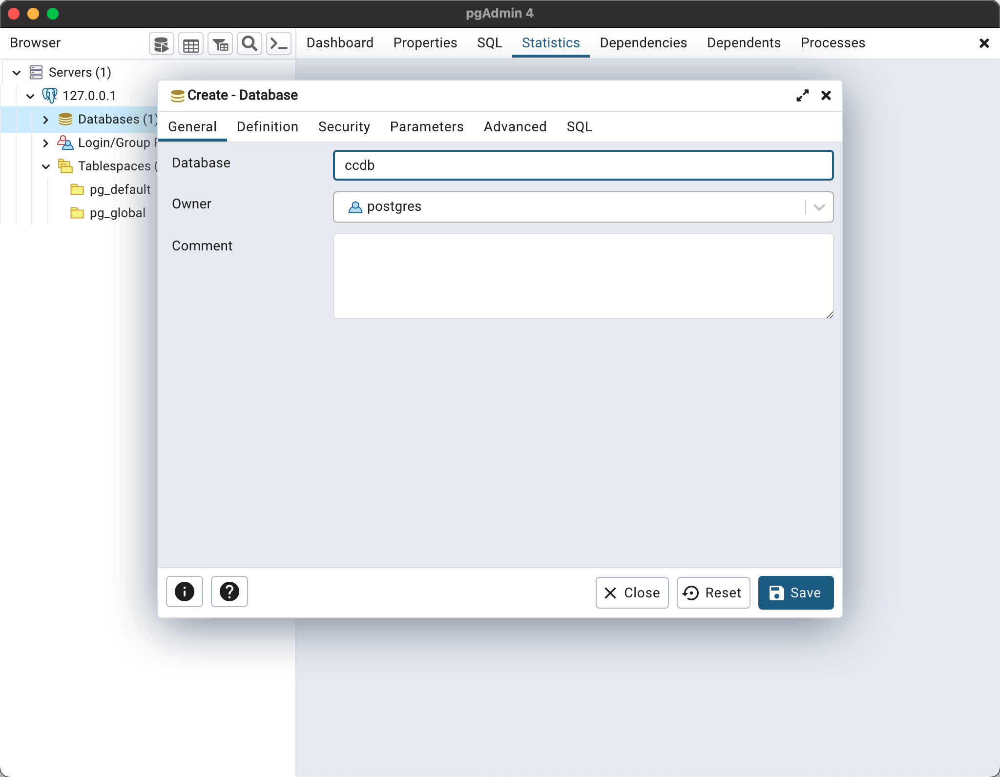


## Google Calendar

The Google API requires a json file for the service account, so the best way I could figure to get this to work was to base64 encode the thing and store it as the environment variable of `GOOGLE_CRED_JSON`. That way I don't have to store it in the source code, and I can't have a multi-line env var on Heroku.

Otherwise the environment variable of `GOOGLE_CAL_ID` points to the name of the claendar to use:

- DEV: `2dbcdac838ad46afef97271b63c8dc213a523a33f85f1b83ea3cc162d14e6963@group.calendar.google.com`
- PROD: f0e93aa61240d9696c787e784352bb761158e6da2b1d63c94695eac63e6240cb@group.calendar.google.com

## Running Locally

In order to be able to schedule appointments, you will need to create at least one accepted student ID, by running the following in pgadmin:

```
insert into accepted_id (student_id) values ('T01');
```

It is then a matter of executing the main class of `ClothesclosetApplication`, but then having to go in and change that runtime to include the environmment variables regarding the calendar for:

- GOOGLE_CRED_JSON
- GOOGLE_CAL_ID
- SMTP_PASSWORD

# Heroku Runtime Environment

All inputs are represented as environment variables under the settings:

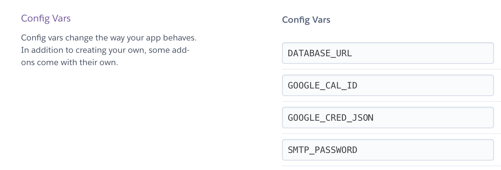

- **DATABASE_URL** - This is generated and maintained by Heroku itself, noting that the URL changes with credential rotation and is also wrong. I had to write a special data handler to pull the username, password, and URL for JDBC out of this
- **GOOGLE_CAL_ID** - The ID of the calendaer
- **GOOGLE_CRED_JSON** - The base64 encoded credentials.json from the Google service account
- **SMTP_PASSWORD** - The GoDaddy SMTP password for noreply@clothescloset.app

It is otherwise setup to run test and check automation on code change, and then direclty deploy to production:

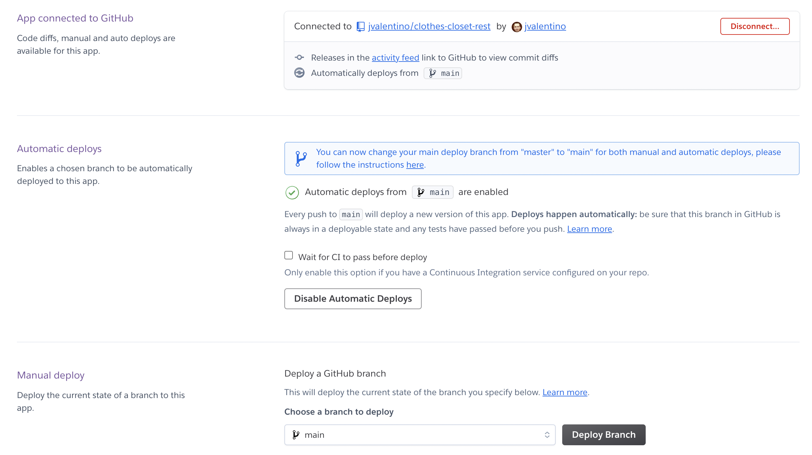

# Security

The plan is simple enough:

1. Client uses the Google Login button, that when pressed directs you to sign in with your Google Account
2. On Google Sign In, the result is that the client is given a JWT token (signed by Google)
3. Client passes the JWT token to the login service, which validates it, checks that the email address is a known admin, and if so creates a session as identified by a session ID, which is then returned to the client (https://developers.google.com/identity/openid-connect/openid-connect#java)
4. The client provides the session id with each request to prove validation as the header x-auth-token
5. Unless explicitly listed, every endpoint requires a valid session ID
6. The session is managed by Spring Security via JDBC storage, which means it handles expiration automatically

Great, and I am sure there is some way to get this working out-of-the-box with Spring Security and OAuth2. Unforunately, for the life of me I could not get it to work using Spring. Therefore, after roughly 8 hours of slamming my head against the wall, I resorted to adding my own custom authentication that handles this. Specifically:

- `CustomAuthenticationProvider` just returns the given `Authentication`, because actual authentication is handled in the `LoginController`
- `MyCORSFilter` grants incoming requests from anywhere using the standard headers. However, while this works with both cURL and Postman, guess who doesn't care? ReactJS. As soon as I attempt to set any header other that Content-Type in ReactJS, it gives me a CORS error. As a result, I made the `SecurityFilter` accept `x-auth-token` as an HTTP parameter as well.
- The `SecurityConfig` is what wires the `CustomAuthenticationProvider` in, as well as list the insecure endpoints in a 2 of the 3 ways. This is because I could not get the `SecurityFilter` to honor the settings here, so I just provide it with a list of the endpoints to ignore.
- The `SecurityFilter` is run on every request, and if the endpoint needs to be secure, looks for the x-auth-token in the header or as a parameter and looks its session up. If it is not found, it errors out. If it is found, it ensures the current request is authorized. Note though that in order to get this to work I had to create a new authorized request and pass it into the security context. While this works, it also ends up creating a new session, which is wrong and should be fixed at some point. This means every logged in user has two sessions instead of just one, but they both expire like they are supposed to.

The `LoginControlller` is where the magic happens, in that it is given the JWT, validates it, pulled out the email address, looks for that email in `AuthUser`, and if valid establishes a new Session ID.

# JSON Serialization

Since we are using Spring magic to map to and from Objects and JSON, we have to consider that if not told otherwise Jackson will lazy load every single Object in an Entity relationship. This is why I had to create `CustomObjectMapper`, which tells this app to:

1. Not fail when a result is empty
2. Not fail if properties are given that do not map to an object
3. Use the Hibernate5 module so that we can tell it to not lazy load everything, but then to also not use `@Transient`. This is because we want `@Transient` to not involve the database but be used as a part of JSON. This is so that we can do things like have an ISO date on an entity that is passed to the client, but that is not stored in the database. The intention was to avoid having a redundant set of DTOs and just use Entities directly.

# Had to do it Once

## Heroku Database Setup

FIrst, this has to be attached to a specific app, so you first have to go about creating the application., which I called `clothes-closet-rest` and is associated with https://github.com/jvalentino/clothes-closet-rest.

```bash
$ heroku addons:create heroku-postgresql:basic --app clothes-closet-rest

Creating heroku-postgresql:basic on ⬢ clothes-closet-rest... $9/month
Database has been created and is available
 ! This database is empty. If upgrading, you can transfer
 ! data from another database with pg:copy

Created postgresql-adjacent-91726 as DATABASE_URL
Use heroku addons:docs heroku-postgresql to view documentation
```

You then can only access it via the Heroku CLI:

```bash
$ heroku pg:psql --app clothes-closet-rest
 ›   Warning: heroku update available from 7.60.2 to 7.67.1.
--> Connecting to postgresql-adjacent-91726
psql (14.6 (Homebrew))
SSL connection (protocol: TLSv1.3, cipher: TLS_AES_256_GCM_SHA384, bits: 256, compression: off)
Type "help" for help.

clothes-closet-rest::DATABASE=> 

```

Doing this generated a DATABASE_URL env var on the app, which will rotate automatically with the credentials. Unforuntatley this URL is actually wrong for JDBC, so I had to write code to extract the creds and generate the URL correctly.

## Calendar Setup

This only had to be done once, but it is worth noting how I did it.

This one one of those things where most of the internet was garbage in terms of figuring this out.

1. You have to have a Google Application
2. That application needs a service account, where you have the JSON export of those credentials
3. Under APIs and services, you need to add `Google Calendar API` 
4. You have to add the service account by its email to that calendar, in this case `clothes-closet-rest@clothes-closet-374119.iam.gserviceaccount.com` to the calendar you want to use under sharing
5. You have to then access that calendar by its ID, for eample for dev I use `2dbcdac838ad46afef97271b63c8dc213a523a33f85f1b83ea3cc162d14e6963@group.calendar.google.com`

If you get the message `Service accounts cannot invite attendees without Domain-Wide Delegation of Authority.`, you need to 


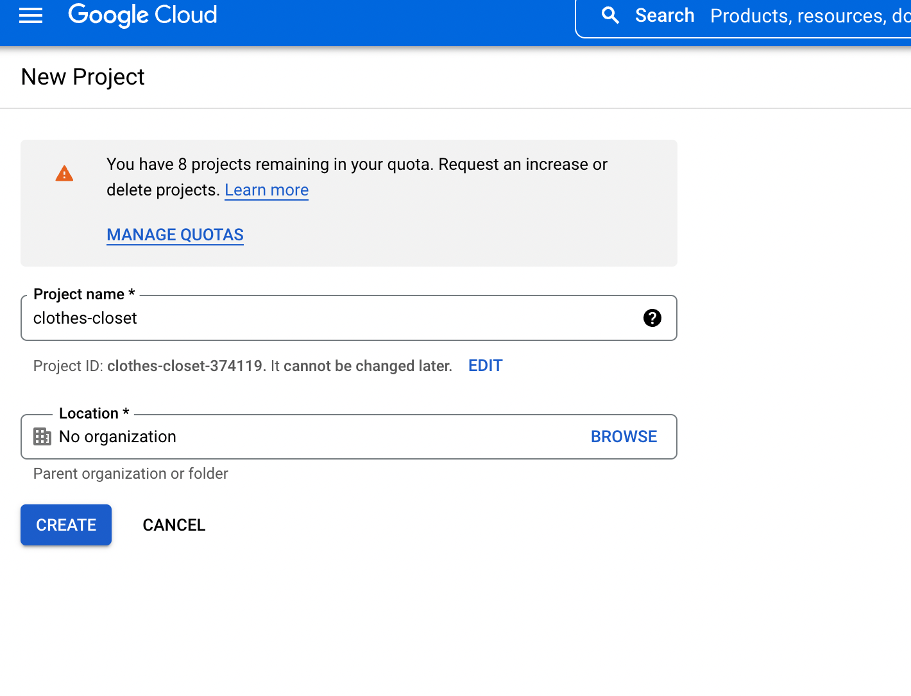


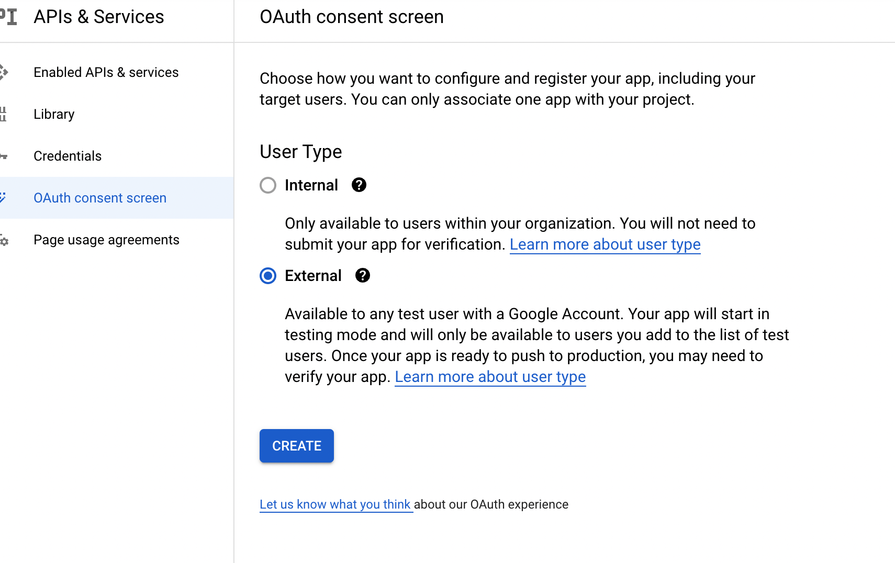

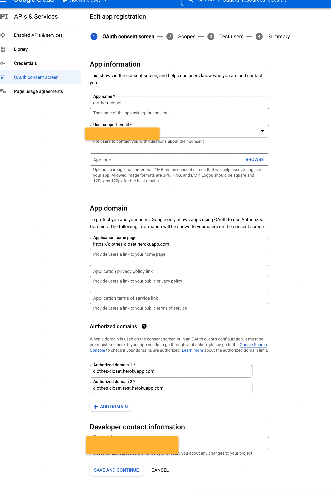

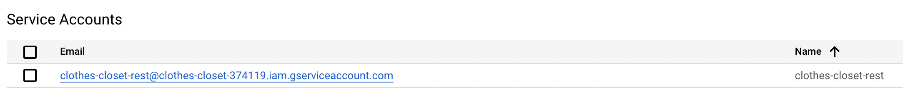

https://console.cloud.google.com/apis/library/calendar-json.googleapis.com?project=clothes-closet-374119


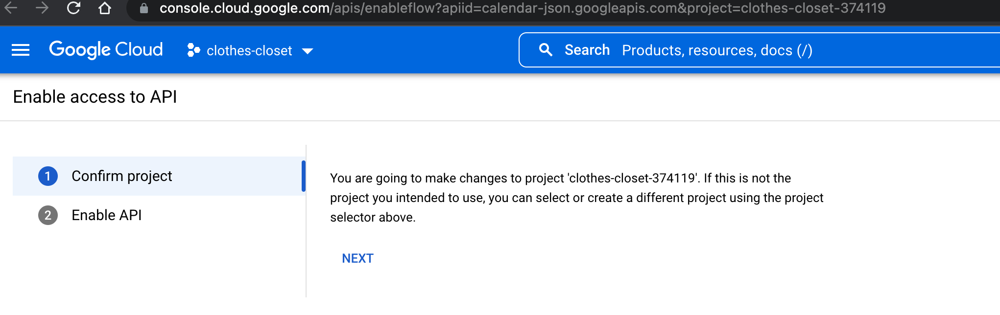

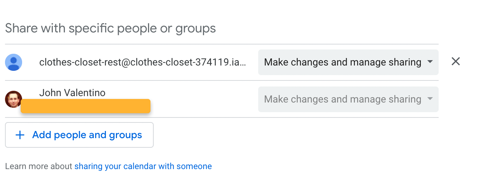


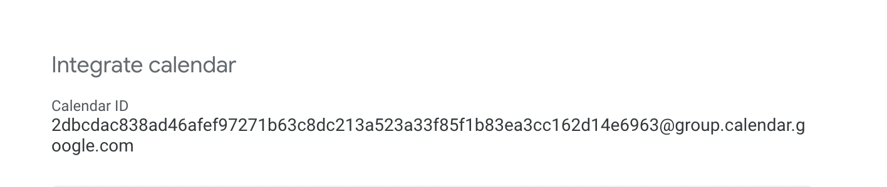

## Google Ouath

Guide: https://livefiredev.com/in-depth-guide-sign-in-with-google-in-a-react-js-application/

Note that you don't need the calender scope, as we are not using the calendar for individual users.

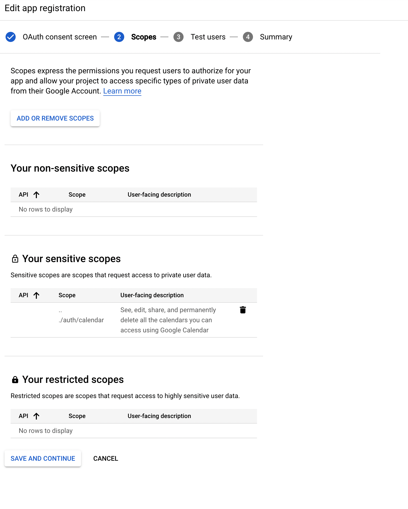

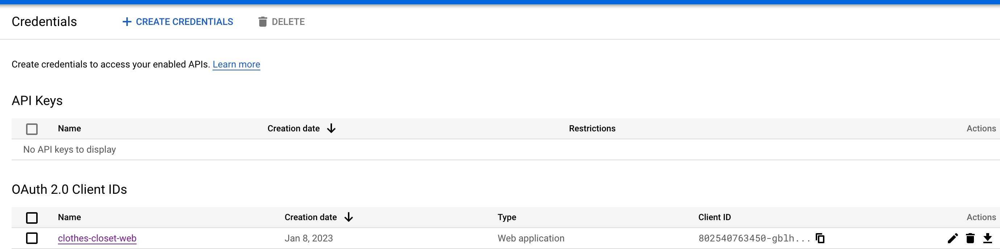

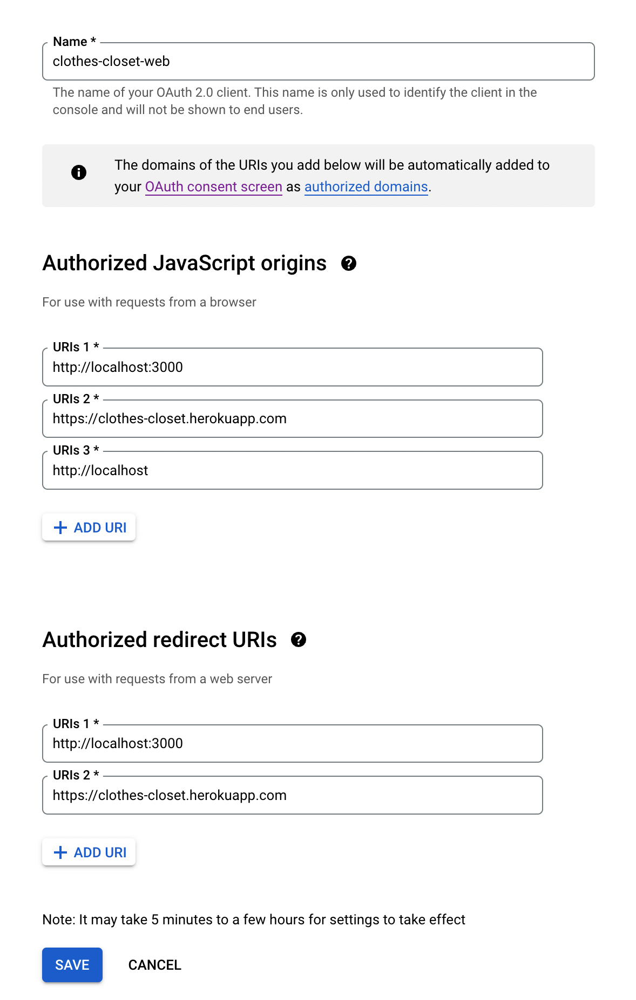


## GoDaddy Domain and SSL

https://www.godaddy.com/ just happens to be the means by which the custom domain of https://clothescloset.app was purchased, including it SSL certificate that is needed for that https part of the URL. This has become required as most browsers won't even allow you to go to an http site by default anymore. Using this with Heroku though required some special DNS-level configuraiton.

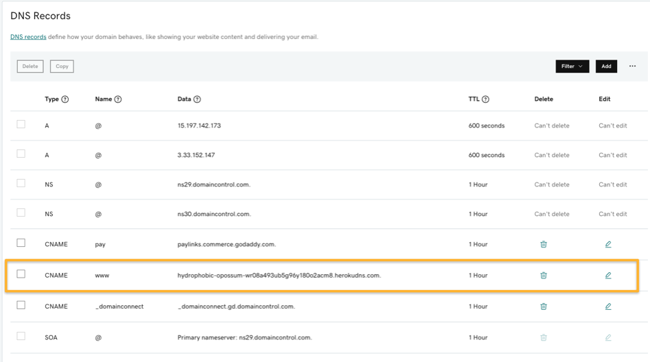

You then have to add the certficate public and private keys to Heroku:

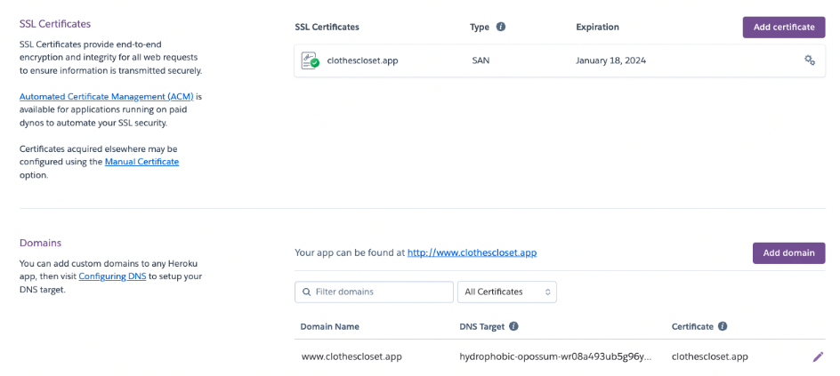


## GoDaddy Email

Note that this first required that the domain be setup, which was done for the front-end: 

- https://github.com/jvalentino/clothes-closet-ui#custom-domain-name-setup

I then had to add basic email support to the domain, and then setup the mailbox:

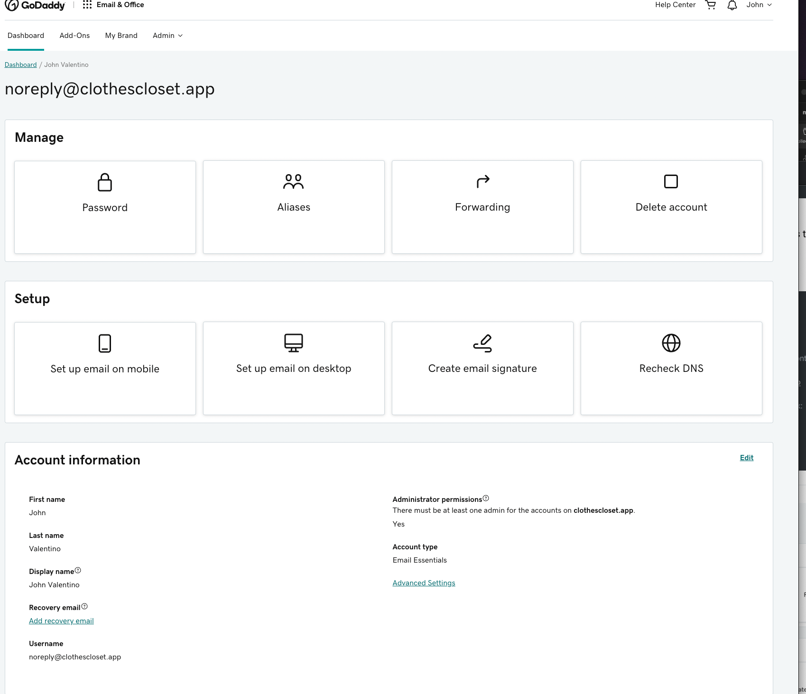

After creating a new email account, you have to manually enable SMTP:

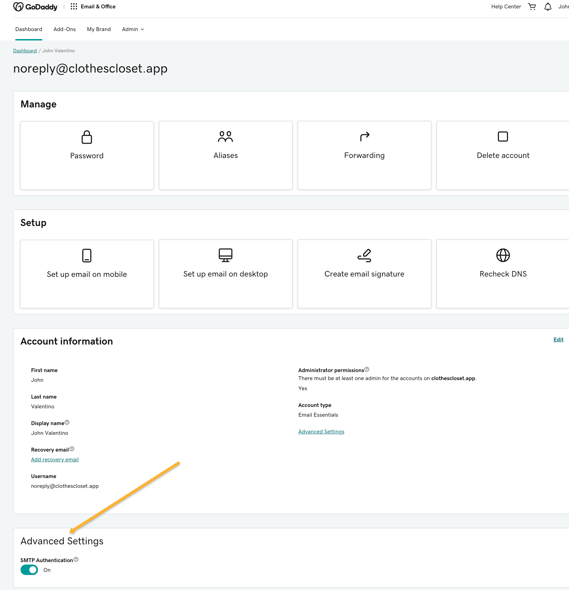

The SMTP settings where then a matter of trial and error:

```properties
spring.mail.host=smtpout.secureserver.net
spring.mail.port=587
spring.mail.username=noreply@clothescloset.app
spring.mail.properties.mail.smtp.auth=true
spring.mail.properties.mail.smtp.starttls.enable=true
```

https://www.godaddy.com/help/server-and-port-settings-for-workspace-email-6949 was the only place to get it correct.


# FAQ

## Reseting the Heroku DB

```sql
heroku addons:create heroku-postgresql:basic --app clothes-closet-rest

drop schema public cascade;
create schema public;
```